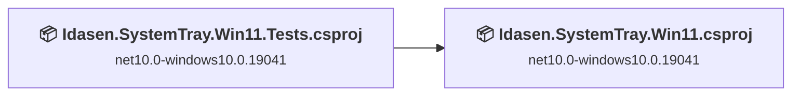
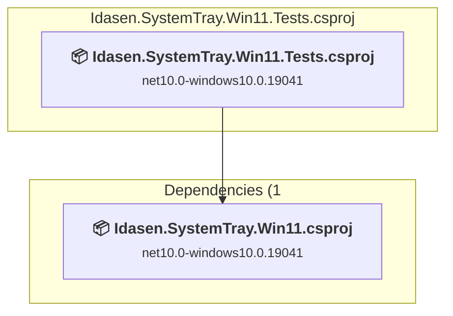
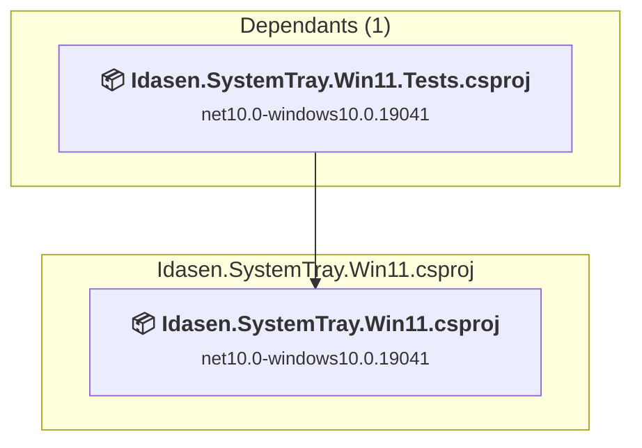

# Projects and dependencies analysis

This document provides a comprehensive overview of the projects and their dependencies in the context of upgrading to .NETCoreApp,Version=v10.0.

## Table of Contents

- [Executive Summary](#executive-Summary)
  - [Highlevel Metrics](#highlevel-metrics)
  - [Projects Compatibility](#projects-compatibility)
  - [Package Compatibility](#package-compatibility)
  - [API Compatibility](#api-compatibility)
- [Aggregate NuGet packages details](#aggregate-nuget-packages-details)
- [Top API Migration Challenges](#top-api-migration-challenges)
  - [Technologies and Features](#technologies-and-features)
  - [Most Frequent API Issues](#most-frequent-api-issues)
- [Projects Relationship Graph](#projects-relationship-graph)
- [Project Details](#project-details)

  - [Idasen.SystemTray.Win11.Tests\Idasen.SystemTray.Win11.Tests.csproj](#idasensystemtraywin11testsidasensystemtraywin11testscsproj)
  - [Idasen.SystemTray.Win11\Idasen.SystemTray.Win11.csproj](#idasensystemtraywin11idasensystemtraywin11csproj)

## Executive Summary

### Highlevel Metrics

| Metric | Count | Status |
| :--- | :---: | :--- |
| Total Projects | 2 | 0 require upgrade |
| Total NuGet Packages | 30 | All compatible |
| Total Code Files | 106 |  |
| Total Code Files with Incidents | 0 |  |
| Total Lines of Code | 8410 |  |
| Total Number of Issues | 0 |  |
| Estimated LOC to modify | 0+ | at least 0.0% of codebase |

### Projects Compatibility

| Project | Target Framework | Difficulty | Package Issues | API Issues | Est. LOC Impact | Description |
| :--- | :---: | :---: | :---: | :---: | :---: | :--- |
| [Idasen.SystemTray.Win11.Tests\Idasen.SystemTray.Win11.Tests.csproj](#idasensystemtraywin11testsidasensystemtraywin11testscsproj) | net10.0-windows10.0.19041 | ✅ None | 0 | 0 |  | DotNetCoreApp, Sdk Style = True |
| [Idasen.SystemTray.Win11\Idasen.SystemTray.Win11.csproj](#idasensystemtraywin11idasensystemtraywin11csproj) | net10.0-windows10.0.19041 | ✅ None | 0 | 0 |  | Wpf, Sdk Style = True |

### Package Compatibility

| Status | Count | Percentage |
| :--- | :---: | :---: |
| ✅ Compatible | 30 | 100.0% |
| ⚠️ Incompatible | 0 | 0.0% |
| 🔄 Upgrade Recommended | 0 | 0.0% |
| ***Total NuGet Packages*** | ***30*** | ***100%*** |

### API Compatibility

| Category | Count | Impact |
| :--- | :---: | :--- |
| 🔴 Binary Incompatible | 0 | High - Require code changes |
| 🟡 Source Incompatible | 0 | Medium - Needs re-compilation and potential conflicting API error fixing |
| 🔵 Behavioral change | 0 | Low - Behavioral changes that may require testing at runtime |
| ✅ Compatible | 0 |  |
| ***Total APIs Analyzed*** | ***0*** |  |

## Aggregate NuGet packages details

| Package | Current Version | Suggested Version | Projects | Description |
| :--- | :---: | :---: | :--- | :--- |
| Autofac | 9.1.0 |  | [Idasen.SystemTray.Win11.csproj](#idasensystemtraywin11idasensystemtraywin11csproj) | ✅Compatible |
| Autofac.Extensions.DependencyInjection | 11.0.0 |  | [Idasen.SystemTray.Win11.csproj](#idasensystemtraywin11idasensystemtraywin11csproj) | ✅Compatible |
| AutofacSerilogIntegration | 5.0.0 |  | [Idasen.SystemTray.Win11.csproj](#idasensystemtraywin11idasensystemtraywin11csproj) | ✅Compatible |
| CommunityToolkit.Mvvm | 8.4.2 |  | [Idasen.SystemTray.Win11.csproj](#idasensystemtraywin11idasensystemtraywin11csproj) | ✅Compatible |
| coverlet.collector | 10.0.0 |  | [Idasen.SystemTray.Win11.Tests.csproj](#idasensystemtraywin11testsidasensystemtraywin11testscsproj) | ✅Compatible |
| FluentAssertions | 8.9.0 |  | [Idasen.SystemTray.Win11.Tests.csproj](#idasensystemtraywin11testsidasensystemtraywin11testscsproj) | ✅Compatible |
| Idasen.Desk.Core | 0.1.160 |  | [Idasen.SystemTray.Win11.csproj](#idasensystemtraywin11idasensystemtraywin11csproj) [Idasen.SystemTray.Win11.Tests.csproj](#idasensystemtraywin11testsidasensystemtraywin11testscsproj) | ✅Compatible |
| Microsoft.Extensions.Hosting | 10.0.7 |  | [Idasen.SystemTray.Win11.csproj](#idasensystemtraywin11idasensystemtraywin11csproj) | ✅Compatible |
| Microsoft.NET.Test.Sdk | 18.5.1 |  | [Idasen.SystemTray.Win11.Tests.csproj](#idasensystemtraywin11testsidasensystemtraywin11testscsproj) | ✅Compatible |
| Microsoft.Reactive.Testing | 6.1.0 |  | [Idasen.SystemTray.Win11.Tests.csproj](#idasensystemtraywin11testsidasensystemtraywin11testscsproj) | ✅Compatible |
| Microsoft.Toolkit.Uwp.Notifications | 7.1.3 |  | [Idasen.SystemTray.Win11.csproj](#idasensystemtraywin11idasensystemtraywin11csproj) | ✅Compatible |
| NHotkey.Wpf | 4.0.0 |  | [Idasen.SystemTray.Win11.csproj](#idasensystemtraywin11idasensystemtraywin11csproj) | ✅Compatible |
| NSubstitute | 5.3.0 |  | [Idasen.SystemTray.Win11.Tests.csproj](#idasensystemtraywin11testsidasensystemtraywin11testscsproj) | ✅Compatible |
| Serilog | 4.3.1 |  | [Idasen.SystemTray.Win11.csproj](#idasensystemtraywin11idasensystemtraywin11csproj) | ✅Compatible |
| Serilog.Enrichers.Environment | 3.0.1 |  | [Idasen.SystemTray.Win11.csproj](#idasensystemtraywin11idasensystemtraywin11csproj) | ✅Compatible |
| Serilog.Enrichers.Process | 3.0.0 |  | [Idasen.SystemTray.Win11.csproj](#idasensystemtraywin11idasensystemtraywin11csproj) | ✅Compatible |
| Serilog.Enrichers.Thread | 4.0.0 |  | [Idasen.SystemTray.Win11.csproj](#idasensystemtraywin11idasensystemtraywin11csproj) | ✅Compatible |
| Serilog.Extensions.Autofac.DependencyInjection | 5.0.0 |  | [Idasen.SystemTray.Win11.csproj](#idasensystemtraywin11idasensystemtraywin11csproj) | ✅Compatible |
| Serilog.Settings.Configuration | 10.0.0 |  | [Idasen.SystemTray.Win11.csproj](#idasensystemtraywin11idasensystemtraywin11csproj) | ✅Compatible |
| Serilog.Sinks.Async | 2.1.0 |  | [Idasen.SystemTray.Win11.csproj](#idasensystemtraywin11idasensystemtraywin11csproj) | ✅Compatible |
| Serilog.Sinks.Console | 6.1.1 |  | [Idasen.SystemTray.Win11.csproj](#idasensystemtraywin11idasensystemtraywin11csproj) | ✅Compatible |
| Serilog.Sinks.File | 7.0.0 |  | [Idasen.SystemTray.Win11.csproj](#idasensystemtraywin11idasensystemtraywin11csproj) | ✅Compatible |
| System.IO.Abstractions | 22.1.1 |  | [Idasen.SystemTray.Win11.csproj](#idasensystemtraywin11idasensystemtraywin11csproj) [Idasen.SystemTray.Win11.Tests.csproj](#idasensystemtraywin11testsidasensystemtraywin11testscsproj) | ✅Compatible |
| System.IO.Abstractions.TestingHelpers | 22.1.1 |  | [Idasen.SystemTray.Win11.Tests.csproj](#idasensystemtraywin11testsidasensystemtraywin11testscsproj) | ✅Compatible |
| Testably.Abstractions.FileSystem.Interface | 10.2.0 |  | [Idasen.SystemTray.Win11.csproj](#idasensystemtraywin11idasensystemtraywin11csproj) | ✅Compatible |
| WPF-UI | 4.2.1 |  | [Idasen.SystemTray.Win11.csproj](#idasensystemtraywin11idasensystemtraywin11csproj) | ✅Compatible |
| WPF-UI.Tray | 4.2.1 |  | [Idasen.SystemTray.Win11.csproj](#idasensystemtraywin11idasensystemtraywin11csproj) | ✅Compatible |
| xunit | 2.9.3 |  | [Idasen.SystemTray.Win11.Tests.csproj](#idasensystemtraywin11testsidasensystemtraywin11testscsproj) | ✅Compatible |
| xunit.abstractions | 2.0.3 |  | [Idasen.SystemTray.Win11.csproj](#idasensystemtraywin11idasensystemtraywin11csproj) | ✅Compatible |
| xunit.runner.visualstudio | 3.1.5 |  | [Idasen.SystemTray.Win11.Tests.csproj](#idasensystemtraywin11testsidasensystemtraywin11testscsproj) | ✅Compatible |

## Top API Migration Challenges

### Technologies and Features

| Technology | Issues | Percentage | Migration Path |
| :--- | :---: | :---: | :--- |

### Most Frequent API Issues

| API | Count | Percentage | Category |
| :--- | :---: | :---: | :--- |

## Projects Relationship Graph

Legend:
📦 SDK-style project
⚙️ Classic project

## Project Details

### Idasen.SystemTray.Win11.Tests\Idasen.SystemTray.Win11.Tests.csproj

#### Project Info

- **Current Target Framework:** net10.0-windows10.0.19041✅
- **SDK-style**: True
- **Project Kind:** DotNetCoreApp
- **Dependencies**: 1
- **Dependants**: 0
- **Number of Files**: 29
- **Lines of Code**: 2892
- **Estimated LOC to modify**: 0+ (at least 0.0% of the project)

#### Dependency Graph

Legend:
📦 SDK-style project
⚙️ Classic project

### API Compatibility

| Category | Count | Impact |
| :--- | :---: | :--- |
| 🔴 Binary Incompatible | 0 | High - Require code changes |
| 🟡 Source Incompatible | 0 | Medium - Needs re-compilation and potential conflicting API error fixing |
| 🔵 Behavioral change | 0 | Low - Behavioral changes that may require testing at runtime |
| ✅ Compatible | 0 |  |
| ***Total APIs Analyzed*** | ***0*** |  |

### Idasen.SystemTray.Win11\Idasen.SystemTray.Win11.csproj

#### Project Info

- **Current Target Framework:** net10.0-windows10.0.19041✅
- **SDK-style**: True
- **Project Kind:** Wpf
- **Dependencies**: 0
- **Dependants**: 1
- **Number of Files**: 82
- **Lines of Code**: 5518
- **Estimated LOC to modify**: 0+ (at least 0.0% of the project)

#### Dependency Graph

Legend:
📦 SDK-style project
⚙️ Classic project

### API Compatibility

| Category | Count | Impact |
| :--- | :---: | :--- |
| 🔴 Binary Incompatible | 0 | High - Require code changes |
| 🟡 Source Incompatible | 0 | Medium - Needs re-compilation and potential conflicting API error fixing |
| 🔵 Behavioral change | 0 | Low - Behavioral changes that may require testing at runtime |
| ✅ Compatible | 0 |  |
| ***Total APIs Analyzed*** | ***0*** |  |

